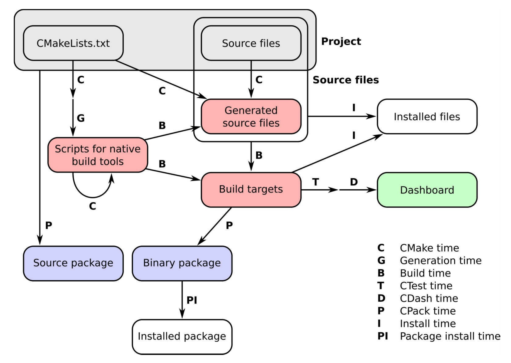

# CMake Study Notes

这里是 CMake 学习笔记和源码整理，基于 [CMake Tutorial](https://cmake.org/cmake/help/latest/guide/tutorial/index.html) 和 C 语言。在 00_template 文件夹下总结了一些常用的 CMake 工程模板。

CMake 是一个管理源代码构建的工具，主要用于 C/C++ 语言的项目，最初被设计为 Makefile 文件的生成器，它制定了一套语法规范，可以描述目标文件（可执行文件和链接库文件）的构建过程和所需条件。CMake 的工作流分为许多阶段(time)，总结如下图：

1. Configure time，这个阶段中，CMake 将处理项目中的 CMakeLists.txt 文件并配置它。
2. Generation time，配置成功后，CMake将生成本地构建工具所需的脚本，以执行项目中的后续步骤。
3. Build time，这是在平台和工具原生构建脚本上调用原生构建工具的时候，这些脚本以前是由CMake生成的。此时，将调用编译器，并在特定的构建目录中构建目标(可执行文件和库)。注意递归的CMake time箭头：这看起来令人困惑，但是我们将在本书中多次使用它，用来实现平台无关的构建。
4. CTest time或 test time，运行项目的测试套件，以检查目标是否按预期执行。
5. CDash time或report time，将测试结果上传到面板，与其他开发人员共享。
6. Install time，将项目的目标、源文件、可执行文件和库从构建目录安装到安装位置。
8. CPack time或packaging time，将项目打包以便发布，可以是源代码，也可以是二进制代码。
9. Package install time，在系统范围内安装新生成的包。

深入学习可以参考 CMake Cookbook ：
- CMake Cookbook 原文：https://github.com/PacktPublishing/CMake-Cookbook
- CMake Cookbook 翻译：https://chenxiaowei.gitbook.io/cmake-cookbook
- CMake Cookbook 翻译：https://github.com/xiaoweiChen/CMake-Cookbook

[官网](https://cmake.org/cmake/help/latest/index.html)上还提供了很多文档：

- 基于 CMake 的构建系统的工作原理可以参考 [CMake Build System](https://cmake.org/cmake/help/latest/manual/cmake-buildsystem.7.html)。
- CMake还提供了图形化的交换软件，可以参考 [User Interaction Guide](https://cmake.org/cmake/help/latest/guide/user-interaction/index.html)。
- cmake 命令的使用方法可以参考 [cmake](https://cmake.org/cmake/help/latest/manual/cmake.1.html)